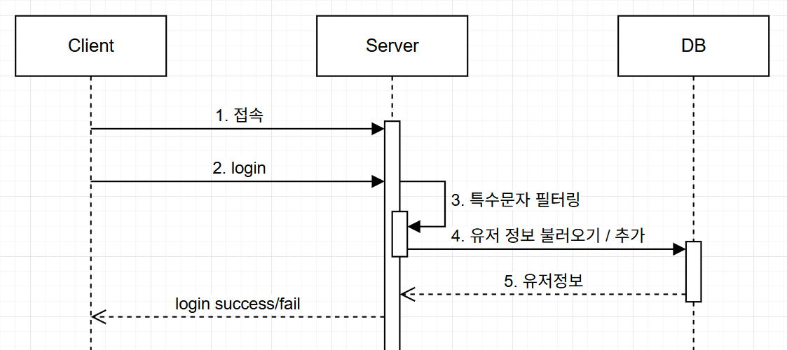
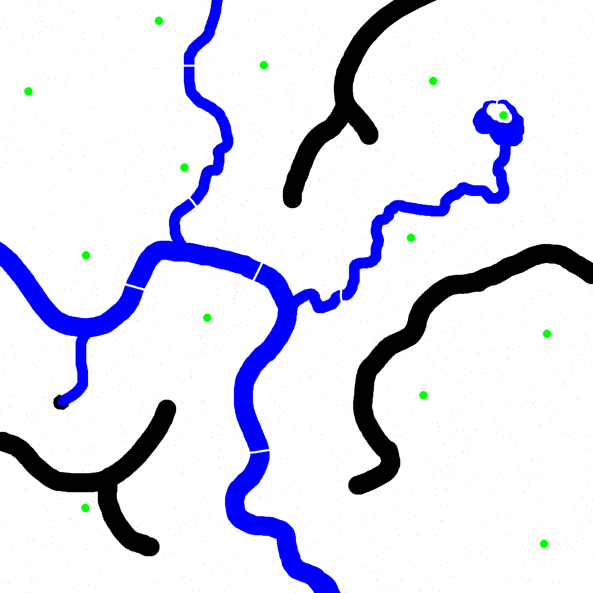
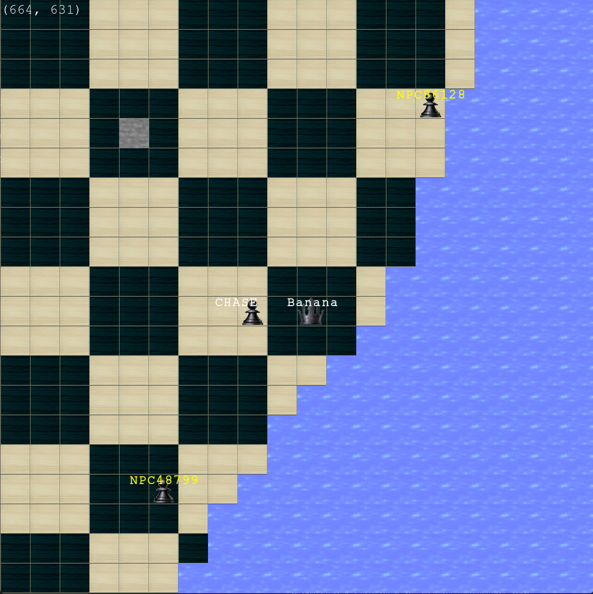

<h1 align="center" style="margin: 0.1em">게임서버프로그래밍</h1>
<h1 align="center" style="margin: 0.1em">텀프로젝트</h1>

2020180028 이주형

 

서버는 DB thread, AI thread, Worker thread로 구성되어 있으며, 각 쓰레드는 `concurrent_priority_queue`와 `PostQueuedCompletionStatus`등을 이용하여 통신한다.

#### 로그인
- 클라이언트는 서버 주소를 입력하여 서버에 접속한 후 아이디를 입력하여 로그인한다.  
- 서버는 SQL Injection을 방지하기 위해 아이디의 특수문자를 필터링하고, DB로부터 유저 정보를 불러온다.
- DB에 아이디가 존재하지 않는다면 새로운 유저를 생성한다.

#### 게임 진행
로그인에 성공하면 플레이어 캐릭터를 조작하여 맵을 돌아다닐 수 있다.
- 이동: 방향키

서버는 View List와 Sector를 적용하여 최적화했다.  
서버에서는 패킷 조립을 위해 queue와 비슷한 자료구조를 사용한다. char배열을 넣으면 패킷의 크기만큼씩 모아서 queue에 넣고 pop으로 하나씩 꺼내서 처리한다.  

#### 맵
- 맵은 2000x2000의 이미지로부터 만든 텍스트 파일에서 불러온다.
- 흰색(' ')은 빈 공간, 검은색('#')과 파란색('W')은 이동 불가(돌, 물), 초록색('S')은 리스폰 위치이다.

  
  

#### 플레이어
- 플레이어는 처음 접속시나 사망시 랜덤한 리스폰 위치에서 스폰되고 체력을 회복한다.
- 플레이어 공격은 구현하지 못했다.

#### 몬스터
- 몬스터는 빈 공간에서 스폰되며, 플레이어가 근처에 있을때만 활성화되고 감지 거리 내의 플레이어를 추적한다.
- 몬스터는 플레이어를 추적할 때 A* 알고리즘을 사용하여 이동한다.

#### DB 
- DB에는 플레이어 아이디, 레벨, 경험치, 체력, 위치 정보가 저장된다.
- 플레이어가 접속할 때마다 stored procedure를 사용하여 정보를 불러오고, 접속 종료시 정보를 저장한다.
